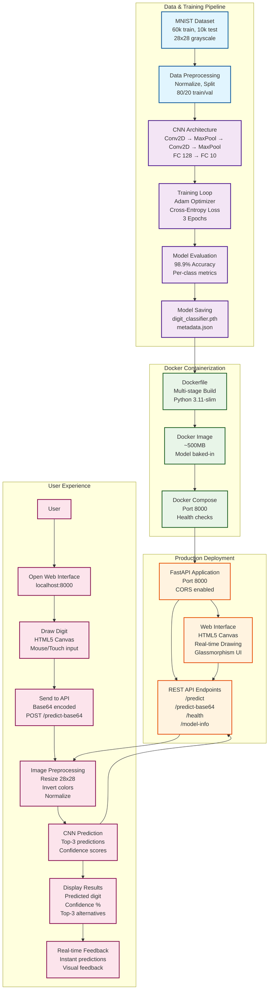
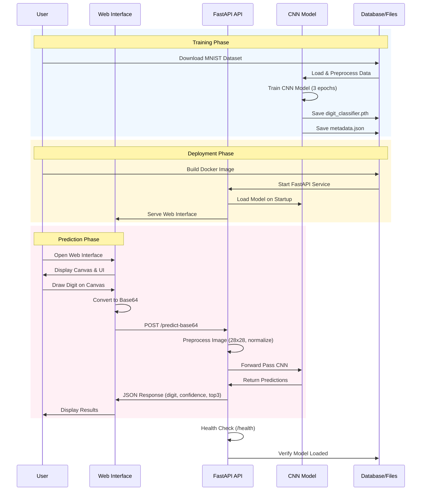
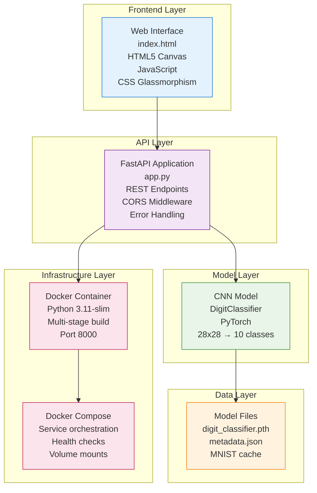
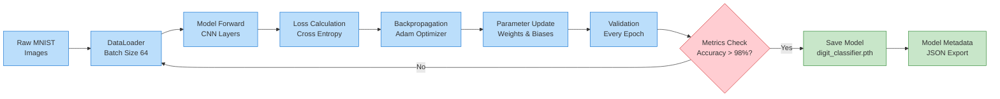
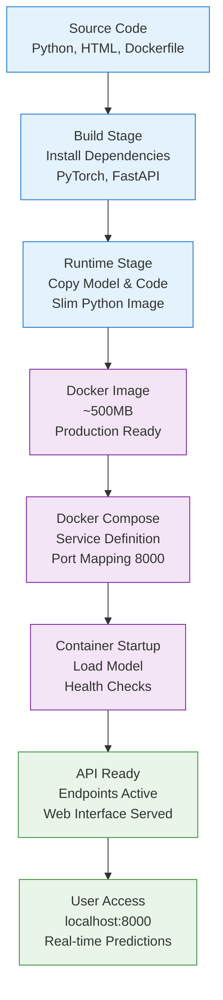

# CNN Digit Recognition System Architecture

## 🏗️ System Architecture & Data Flow

```mermaid
graph TB
    %% Data Sources & Training
    subgraph "Data & Training Pipeline"
        A[MNIST Dataset<br/>60k train, 10k test<br/>28x28 grayscale] --> B[Data Preprocessing<br/>Normalize, Split<br/>80/20 train/val]
        B --> C[CNN Architecture<br/>Conv2D → MaxPool → Conv2D → MaxPool<br/>FC 128 → FC 10]
        C --> D[Training Loop<br/>Adam Optimizer<br/>Cross-Entropy Loss<br/>3 Epochs]
        D --> E[Model Evaluation<br/>98.9% Accuracy<br/>Per-class metrics]
        E --> F[Model Saving<br/>digit_classifier.pth<br/>metadata.json]
    end

    %% Deployment Architecture
    subgraph "Docker Containerization"
        F --> G[Dockerfile<br/>Multi-stage Build<br/>Python 3.11-slim]
        G --> H[Docker Image<br/>~500MB<br/>Model baked-in]
        H --> I[Docker Compose<br/>Port 8000<br/>Health checks]
    end

    %% Runtime Architecture
    subgraph "Production Deployment"
        I --> J[FastAPI Application<br/>Port 8000<br/>CORS enabled]
        J --> K[REST API Endpoints<br/>/predict<br/>/predict-base64<br/>/health<br/>/model-info]
        J --> L[Web Interface<br/>HTML5 Canvas<br/>Real-time Drawing<br/>Glassmorphism UI]
    end

    %% User Interaction Flow
    subgraph "User Experience"
        M[User] --> N[Open Web Interface<br/>localhost:8000]
        N --> O[Draw Digit<br/>HTML5 Canvas<br/>Mouse/Touch input]
        O --> P[Send to API<br/>Base64 encoded<br/>POST /predict-base64]
        P --> Q[Image Preprocessing<br/>Resize 28x28<br/>Invert colors<br/>Normalize]
        Q --> R[CNN Prediction<br/>Top-3 predictions<br/>Confidence scores]
        R --> S[Display Results<br/>Predicted digit<br/>Confidence %<br/>Top-3 alternatives]
        S --> T[Real-time Feedback<br/>Instant predictions<br/>Visual feedback]
    end

    %% Data Flow Connections
    L --> K
    K --> Q
    R --> K

    %% Styling
    classDef dataSource fill:#e1f5fe,stroke:#01579b,stroke-width:2px
    classDef training fill:#f3e5f5,stroke:#4a148c,stroke-width:2px
    classDef deployment fill:#e8f5e8,stroke:#1b5e20,stroke-width:2px
    classDef runtime fill:#fff3e0,stroke:#e65100,stroke-width:2px
    classDef user fill:#fce4ec,stroke:#880e4f,stroke-width:2px

    class A,B dataSource
    class C,D,E,F training
    class G,H,I deployment
    class J,K,L runtime
    class M,N,O,P,Q,R,S,T user
```

## 🔄 Detailed Data Flow

```mermaid
sequenceDiagram
    participant U as User
    participant W as Web Interface
    participant A as FastAPI API
    participant M as CNN Model
    participant D as Database/Files

    %% Training Phase
    rect rgb(240, 248, 255)
        Note over U,D: Training Phase
        U->>D: Download MNIST Dataset
        D->>M: Load & Preprocess Data
        M->>M: Train CNN Model (3 epochs)
        M->>D: Save digit_classifier.pth
        M->>D: Save metadata.json
    end

    %% Deployment Phase
    rect rgb(255, 248, 220)
        Note over U,D: Deployment Phase
        U->>D: Build Docker Image
        D->>A: Start FastAPI Service
        A->>M: Load Model on Startup
        A->>W: Serve Web Interface
    end

    %% Prediction Phase
    rect rgb(255, 240, 245)
        Note over U,W: Prediction Phase
        U->>W: Open Web Interface
        W->>U: Display Canvas & UI
        U->>W: Draw Digit on Canvas
        W->>W: Convert to Base64
        W->>A: POST /predict-base64
        A->>A: Preprocess Image (28x28, normalize)
        A->>M: Forward Pass CNN
        M->>A: Return Predictions
        A->>W: JSON Response (digit, confidence, top3)
        W->>U: Display Results
    end

    %% Health Monitoring
    A->>A: Health Check (/health)
    A->>D: Verify Model Loaded
```

## 🏛️ Component Architecture

```mermaid
graph TD
    subgraph "Frontend Layer"
        UI[Web Interface<br/>index.html<br/>HTML5 Canvas<br/>JavaScript<br/>CSS Glassmorphism]
    end

    subgraph "API Layer"
        API[FastAPI Application<br/>app.py<br/>REST Endpoints<br/>CORS Middleware<br/>Error Handling]
    end

    subgraph "Model Layer"
        MODEL[CNN Model<br/>DigitClassifier<br/>PyTorch<br/>28x28 → 10 classes]
    end

    subgraph "Data Layer"
        DATA[Model Files<br/>digit_classifier.pth<br/>metadata.json<br/>MNIST cache]
    end

    subgraph "Infrastructure Layer"
        DOCKER[Docker Container<br/>Python 3.11-slim<br/>Multi-stage build<br/>Port 8000]
        COMPOSE[Docker Compose<br/>Service orchestration<br/>Health checks<br/>Volume mounts]
    end

    UI --> API
    API --> MODEL
    MODEL --> DATA
    API --> DOCKER
    DOCKER --> COMPOSE

    classDef frontend fill:#e3f2fd,stroke:#1976d2
    classDef api fill:#f3e5f5,stroke:#7b1fa2
    classDef model fill:#e8f5e8,stroke:#388e3c
    classDef data fill:#fff3e0,stroke:#f57c00
    classDef infra fill:#fce4ec,stroke:#c2185b

    class UI frontend
    class API api
    class MODEL model
    class DATA data
    class DOCKER,COMPOSE infra
```

## 📊 Training Metrics Flow

```mermaid
flowchart LR
    A[Raw MNIST<br/>Images] --> B[DataLoader<br/>Batch Size 64]
    B --> C[Model Forward<br/>CNN Layers]
    C --> D[Loss Calculation<br/>Cross Entropy]
    D --> E[Backpropagation<br/>Adam Optimizer]
    E --> F[Parameter Update<br/>Weights & Biases]
    F --> G[Validation<br/>Every Epoch]
    G --> H{Metrics Check<br/>Accuracy > 98%?}
    H -->|No| B
    H -->|Yes| I[Save Model<br/>digit_classifier.pth]
    I --> J[Model Metadata<br/>JSON Export]

    classDef process fill:#bbdefb,stroke:#1976d2
    classDef decision fill:#ffcdd2,stroke:#d32f2f
    classDef output fill:#c8e6c9,stroke:#388e3c

    class A,B,C,D,E,F,G process
    class H decision
    class I,J output
```

## 🚀 Deployment Pipeline

```mermaid
flowchart TD
    A[Source Code<br/>Python, HTML, Dockerfile] --> B[Build Stage<br/>Install Dependencies<br/>PyTorch, FastAPI]
    B --> C[Runtime Stage<br/>Copy Model & Code<br/>Slim Python Image]
    C --> D[Docker Image<br/>~500MB<br/>Production Ready]
    D --> E[Docker Compose<br/>Service Definition<br/>Port Mapping 8000]
    E --> F[Container Startup<br/>Load Model<br/>Health Checks]
    F --> G[API Ready<br/>Endpoints Active<br/>Web Interface Served]
    G --> H[User Access<br/>localhost:8000<br/>Real-time Predictions]

    classDef build fill:#e3f2fd,stroke:#1976d2
    classDef deploy fill:#f3e5f5,stroke:#7b1fa2
    classDef runtime fill:#e8f5e8,stroke:#388e3c

    class A,B,C build
    class D,E,F deploy
    class G,H runtime
```